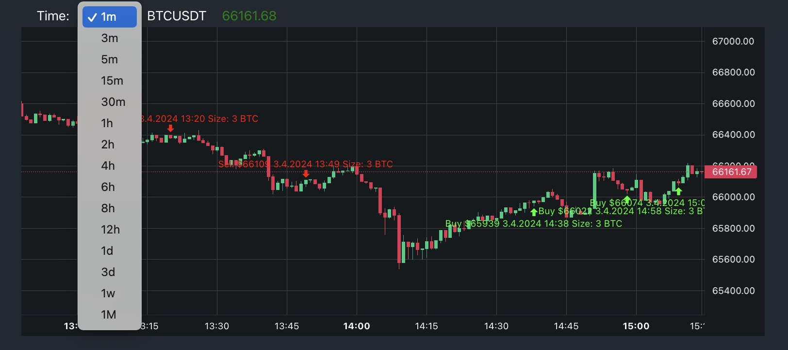

# Test task Apex-TECH

This project, was builded with: create-react-app, lightweight-charts, axios

# Install npm package of this project

This project was published on npm, u can install package with this project using:
npm i apex-tech-test

## Available Scripts

### `npm install`

### `npm start`

Runs the app in the development mode.\
Open [http://localhost:3000](http://localhost:3000) to view it in your browser.

The page will reload when you make changes.\
You may also see any lint errors in the console.

### `npm test`

Launches the test runner in the interactive watch mode.\
See the section about [running tests](https://facebook.github.io/create-react-app/docs/running-tests) for more information.

### `npm run build`

Builds the app for production to the `build` folder.\
It correctly bundles React in production mode and optimizes the build for the best performance.

## Screenshots

Screenshots with basic functionallity:

### Selected time interval 1min

### Selected time interval 12h

### Select with available choices

